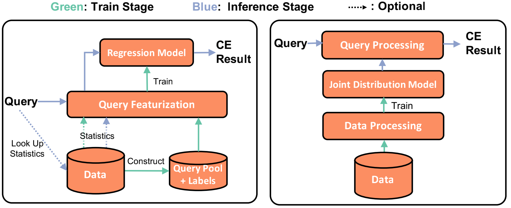
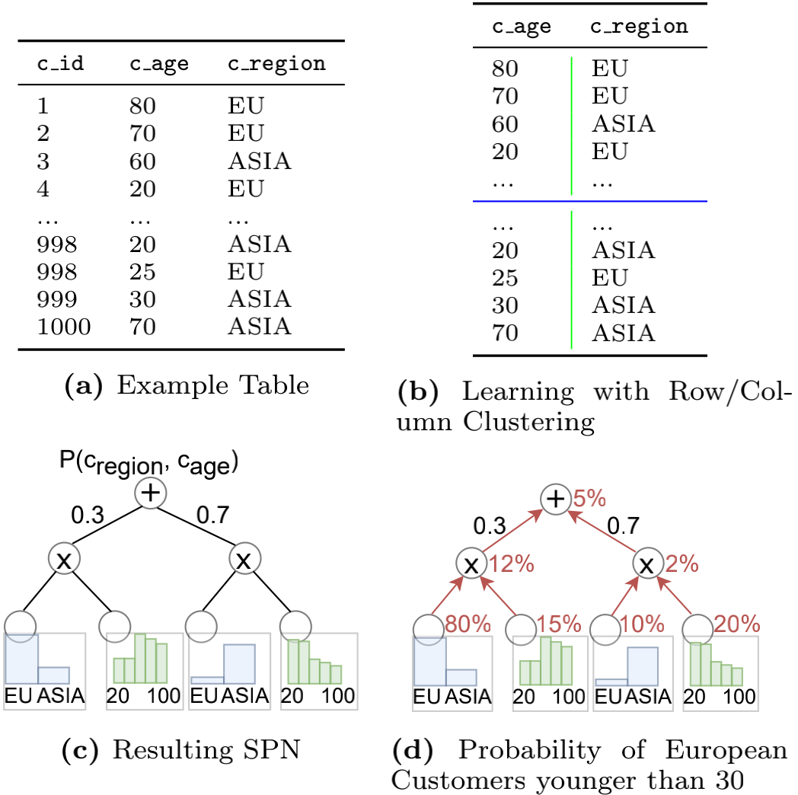
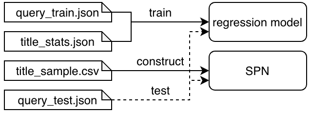

# LAB1 Learning-based Cardinality Estimation

## Introduction
Query optimizers depend on cardinality estimates of query predicates to produce a good execution plan. When a query contains multiple predicates, today’s optimizers use a variety of assumptions, such as independence between predicates, to estimate cardinality. These methods often incur large cardinality estimation errors. Recently, some novel learning-based models are proposed to estimate cardinality, such as deep neural networks, gradient boosted trees, and sum-product networks.

Based on the methodology, we split them into two groups:

+ query-driven methods: they model cardinality estimation as a regression problem and aim to build a mapping between queries and the estimation results via feature vectors.
+ data-driven methods: they model cardinality estimation as a joint probability distribution estimation problem and aim to construct the joint distribution from the table data.



## A query-driven method

We can regard cardinality estimation as a regression problem. Consider table `t` with columns `c1, c2, ..., cn`. For a query `select * from t where c1 > l1 and c1 < r1 and c1 > l2 and c2 < r2 and ... and cn > ln and cn < rn`, we want to predict how many rows left after being filtered by predicates. We extract features from predicates as follows:
```
[l1, r1, l2, r2, ..., ln, rn]
```
Besides, there are several heuristic methods which use information from single column histograms to produce selectivity estimates for conjunction of predicates:
- Attribute Value Independence (AVI): It assumes values for different attributes were chosen independent of each other. Under this assumption, the combined selectivity fraction for predicates on n columns is calculated as `s1 x s2 x ... x sn` where `si` is the selectivity of the i-th column.
- Exponential BackOff (EBO): When columns have correlated values, AVI could cause significant underestimations. EBO calculates the combined selectivity by using only 4 most selective predicates with diminishing impact. The combined selectivity fraction is given by `s_{1} x s_{2}^{1/2} x s_{3}^{1/4} x s_{4}^{1/8}` where `s_{k}` represents k-th most selective fraction across all predicates.
- Minimum Selectivity (MinSel): It calculates the combined selectivity as the minimum selectivity across individual predicates. 

For given conjunction of predicates, the combined actual selectivity depends on the degree of correlation among the predicates. AVI would produce good estimates if the predicates have no correlation while MinSel represents the other extreme compared to AVI. EBO is expected to capture some intermediate scenarios between complete independence and full correlation. We add the estimated produced by the three heuristic methods into the features of the regression model:
```
[l1, r1, l2, r2, ..., ln, rn, est_avi, est_ebo, est_min_sel]
```
which can improve the accuracy and robustness of the regression model.

We can use the regression models such as Multilayer Perceptron (MLP), Gradient Boosting Decision Tree (GBDT) and so on. As for loss function, since we hope to minimize relative error between the estimated rows and the actual rows, we can apply log-transform to the actual rows when generating labels and use the following loss function:
```
loss = MSE(log(act_rows) - log(est_rows)) = MSE(log(act_rows / est_rows)) = MSE(q-error)
```
where `q-error = max(act_rows / est_rows, est_rows / act_rows)`, which is a common metric for cardinality estimation.

You can see [Selectivity Estimation for Range Predicates using Lightweight Models](http://www.vldb.org/pvldb/vol12/p1044-dutt.pdf) for more details.

## A data-driven method
We use sum-product networks(SPN) here to learn the joint probability distribution of our data. It can capture correlation between multiple columns.

Intuitively, sum nodes split rows and product nodes split columns. Leaf nodes represent a single column. For instance, in the picture below, an SPN was learned over the column `region` and `age` of the customer table.

+  The top sum node splits the data into two groups, and the left group contains 30% rows, which is dominated by older European customers, and the right group contains 70% rows with younger Asian customers.
+  Then next in both groups, `region` and `age` are split by a product node each. 
+  The leaf nodes determine the probability distributions of the column `region` and `age` for every group.



Learning SPNs works by recursively splitting the data in different groups of rows (introducing a sum node) or groups of independent columns (introducing a product node). 
+ for the splitting of rows, a standard algorithm such as KMeans can be used. 
+ for the splitting of columns, some measures of correlation such as Pearson correlation coefficient can be used.

With an SPN at hand, we can compute probabilities for predicates on arbitrary columns. Intuitively, the conditions are first evaluated on every relevant leaf. Afterwards, the SPN is evaluated bottom up. 

For instance in the picture above, to estimate `where region='Europe' and age<30`,  we compute the probability of European customers in the corresponding blue region leaf nodes (80% and 10%) and the probability of a customer being younger than 30 (15% and 20%) in the green age leaf nodes. These probabilities are then multiplied at the product node level above, resulting in probabilities of 12% and 2%, respectively. Finally, at the root level (sum node), we have to consider the weights of the clusters, which leads to 12% · 0.3 + 2% · 0.7 = 5%. Multiplied by the number of rows in the table, we get an approximation of 50 European customers who are younger than 30.

You can see [DeepDB: Learn from Data, not from Queries!](http://www.vldb.org/pvldb/vol13/p992-hilprecht.pdf) for more details.

## LAB1

In lab1, you should implement two estimation methods, a query-driven method based on regression models like neural networks and a data-driven method based on SPNs.

### The Input

In this lab, we use `IMDB.title` to train and test our models. All data is in `data` directory and it consists of:

+ `title_schema.sql`: the schema of the table `title`;
+ `query_train_*.json`: queries used to train your model;
+ `query_test_*.json`: queries used to test your model;
+ `title_sample_*.csv`: sample data used to construct your SPN;
+ `title_stats.json`: statistics of `title` exported from TiDB;

For simplicity, all queries we used in lab1 are well formatted range queries with the same pattern `select * from imdb.title where c1>? and c1<? and c2>? and c2<? and ...`.

And all columns that appear in our queries are INT column, more specifically, you can only consider `kind_id`, `production_year`, `imdb_id`, `episode_of_id`, `season_nr`, `episode_nr` columns in lab1.

These files are supposed to be used as below:



### The Code

In `range_query.py`, we've implemented some functions that can help you parse range queries well.

In `statistics.py`, we've implemented some structure related to statistics. `TableStats` is the abstraction of a table's statistics, which consists of multiple columns. A column's statistics is stored in a `Histogram` and a `TopN`, and they can do estimation for single-column predicates well. For multi-column predicates estimation, some estimators based on different strategies(AVI, ExpBackOff and MinSel) can be used.

You need to fill some missing code in `learn_from_query.py`, `learn_from_data.py` and `statistics.py`. Missing code is marked with comment `YOUR CODE HERE`.

After you fill all missing code, you can run `python evaluation.py` and it will test your models and generate a report under `eval` directory.

And a file `eval/results.json` will be generated, please push it to github to trigger auto-grading.

## Reference

1. Anshuman Dutt, Chi Wang, Azade Nazi, Srikanth Kandula, Vivek R. Narasayya, Surajit Chaudhuri:
Selectivity Estimation for Range Predicates using Lightweight Models. Proc. VLDB Endow. 12(9): 1044-1057 (2019)
2. Benjamin Hilprecht, Andreas Schmidt, Moritz Kulessa, Alejandro Molina, Kristian Kersting, Carsten Binnig:
DeepDB: Learn from Data, not from Queries! Proc. VLDB Endow. 13(7): 992-1005 (2020)
