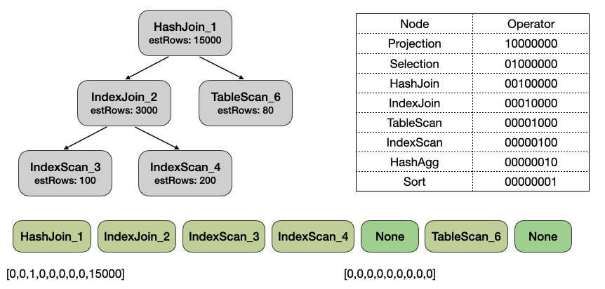
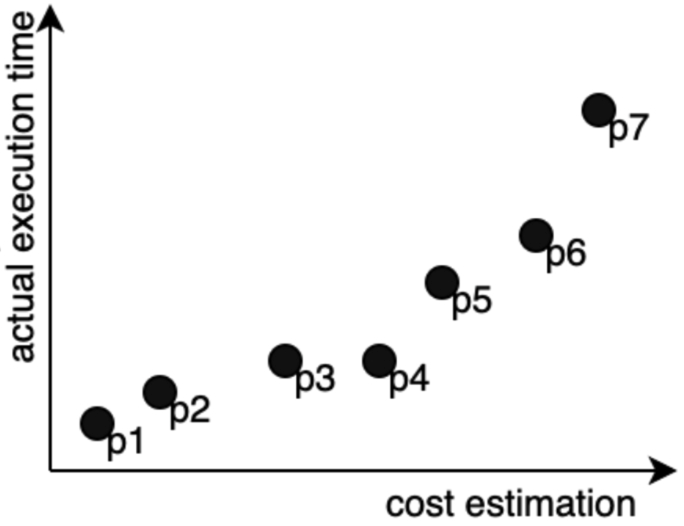

# LAB2 Learning-based Cost Estimation

## Introduction

查询优化器会对一个查询生成多个执行计划，并对每个执行计划预测其执行时间，选出执行时间最短的计划。因此，预测执行计划的执行时间是非常重要。一般优化器会构建代价模型来估算计划的执行时间。但由于数据库的复杂性，代价模型有可能会偏离实际的执行情况。研究者尝试用一些基于学习的方法来实现更好的代价估算。其中一种基于学习的方法是采用机器学习方式来构建代价模型。而另一种方法是用回归的方式校准传统代价模型中的参数。

## Apply Machine Learning To Cost Estimation

机器学习有很强的建模能力，因此我们考虑将其应用于代价估算。大体上来说，我们会先从执行计划中抽取特征，然后输入到机器学习模型中，让模型预测计划的执行时间。你可以在 TiDB 上执行 `EXPLAIN ANALYZE` 语句获得执行计划的相关信息。

```sql
mysql> explain analyze SELECT production_year FROM imdb.title USE INDEX(idx1) WHERE production_year>=1909 AND production_year<=1909 AND kind_id>=0 AND kind_id<=6 AND season_nr>=0 AND season_nr<=57;
+----------------------------+---------+------------+---------+-----------+--------------------------------------------------------------+---------------------------------------------------------------------------------------------------------------------------------------------------------------------------------------------------------------------------------------------------------+-------------------------------------------------------------------------+---------+------+
| id                         | estRows | estCost    | actRows | task      | access object                                                | execution info                                                                                                                                                                                                                                          | operator info                                                           | memory  | disk |
+----------------------------+---------+------------+---------+-----------+--------------------------------------------------------------+---------------------------------------------------------------------------------------------------------------------------------------------------------------------------------------------------------------------------------------------------------+-------------------------------------------------------------------------+---------+------+
| Projection_4               | 3300.00 | 2352790.32 | 3300    | root      |                                                              | time:9.84ms, loops:5, Concurrency:1                                                                                                                                                                                                                     | imdb.title.production_year, row_size: 8                                 | 28.8 KB | N/A  |
| └─IndexReader_7            | 3300.00 | 2253784.32 | 3300    | root      |                                                              | time:9.69ms, loops:5, cop_task: {num: 1, max: 9.56ms, proc_keys: 3300, tot_proc: 4ms, tot_wait: 2ms, rpc_num: 1, rpc_time: 9.49ms, copr_cache: disabled}                                                                                                | index:Selection_6, row_size: 48                                         | 77.8 KB | N/A  |
|   └─Selection_6            | 3300.00 | 1932014.32 | 3300    | cop[tikv] |                                                              | tikv_task:{time:4ms, loops:8}, scan_detail: {total_process_keys: 3300, total_process_keys_size: 211200, total_keys: 3301, rocksdb: {delete_skipped_count: 0, key_skipped_count: 3300, block: {cache_hit_count: 12, read_count: 0, read_byte: 0 Bytes}}} | ge(imdb.title.season_nr, 0), le(imdb.title.season_nr, 57), row_size: 48 | N/A     | N/A  |
|     └─IndexRangeScan_5     | 3300.00 | 1833014.32 | 3300    | cop[tikv] | table:title, index:idx1(production_year, kind_id, season_nr) | tikv_task:{time:4ms, loops:8}                                                                                                                                                                                                                           | range:[1909 0,1909 6], keep order:false, row_size: 48                   | N/A     | N/A  |
+----------------------------+---------+------------+---------+-----------+--------------------------------------------------------------+---------------------------------------------------------------------------------------------------------------------------------------------------------------------------------------------------------------------------------------------------------+-------------------------------------------------------------------------+---------+------+
4 rows in set (0.07 sec)
```

整个执行计划按照树状组织，每一行对应一个算子，主要的信息有：

1. id: 对应的算子名称;
2. estRows: 优化器对该算子返回行数的估算值;
3. actRows: 该算子实际的返回行数;
4. estCost: 优化器对该计划的估计值;
5. execution: 实际的执行情况，包含执行时间;

NOTICE: 训练和测试用的执行计划是通过特殊模式获取的，可以保证 `estRows` 和 `actRows` 一定相同，以避免基数估算误差对代价模型的影响。

你可以从计划当中提取特征，用来训练你的模型；不过请不要使用 `execution info`, `memory`, `disk` 和 `actRows` 字段的信息作为特征，因为这些信息需要在实际执行计划后才能获得，不应该在估算计划代价时被使用。


提取特征的方式可以有多种:

1. 最简单的方式是从各个节点抽取特征然后求和，以这种方式我们可以得到如下特征：
   
    a. 节点总数；
    
    b. 每种算子出现的次数；
    
    c. 每种算子对应的 `estRows` 之和。

    然而，这种抽取特征的方式将执行计划的树形结构丢弃了。
   
2. 第二种方式是从各个节点抽取特征以后，按照 DFS 前序遍历执行计划的顺序将各个节点的特征拼接起来。



   NOTICE1: 在 DFS 前序遍历执行计划时，当我们遍历完该节点的所有孩子之后，我们会插入一个空节点表示所有孩子已经遍历完。这样执行计划和 DFS 前序遍历得到的序列构成了一对一的映射。
   NOTICE2: 不同执行计划有不同数量的节点，因此得到的特征向量长度也不同。我们需要对特征向量做 padding，让它们的长度一致。

你可以使用 MLP、LSTM 等神经网络来对代价模型进行建模。

我们将估算的代价直接和实际执行时间对齐，在计算损失函数时，你可以用如下的平均相对误差：
```
1/N \sum_{i=1}^N |act_time_i - est_cost_i| / act_time_i
```

采用以上方法进行代价估算时，我们需要从计划中提取特征和执行时间，生成训练数据集来训练对应的机器学习模型。

## Calibrate Cost Factors By Regression Model

在这个小节我们将介绍一个更加 "白盒" 的方法来建立我们的 Cost Model。

在传统的数据库系统中，会为每个算子设计不同的代价公式，比如：

1. 对于 Scan 算子，可能采用的代价公式为 `input_rows * row_size * scan_factor`，input_rows 和 row_size 分别对于扫描的行数和行宽，scan_factor 则是扫描代价因子，对应扫描 1 byte 数据的代价；
2. 对于 Sort 算子，可能采用的代价公式为 `input_rows * log2(input_rows) * cpu_factor`，其中 input_rows * log2(input_rows) 对应排序的复杂度，cpu_factor 则是 CPU 代价因子，对应 CPU 处理 1 行数据的代价；

而整个 Plan 的计划则是该 Plan 所有算子代价的累计，可见对于 Plan Cost 而言，关键点有下面两个：

1. 合理的代价公式：代价公式是对算子执行的抽象，需要对算子的物理实现有所了解才能设计出合理的代价公式；
2. 合理的代价因子：代价因子是对物理环境的刻画，比如 cpu_factor 和 scan_factor 的比值可以反应环境中 CPU 和 I/O 的速率；

合理的代价公式需要由人来保证，设计好了代价公式后，可以用回归的方式来对代价因子进行校准。

对于任意的算子，我们可以将其代价转换为代价因子向量(fv)和代价因子权重向量(wv)的乘积，如假设我们代价公式只考虑 scan，cpu，对于 Sort 算子，其代价就是 `[0, input_rows*log2(input_rows)] * [scan_factor, cpu_factor]`。

同理，对于任意 Plan，也可以将其代价转换成上述代价的形式，如下面这个 Plan:

```sql
+----------+---------+---------------+
| id       | estRows | operator info |
+------------------------------------+
| Sort     | 100.00  |               |
| └─Scan   | 100.00  | row_size: 12  |
+----------+---------+---------------+
```

其代价可以转换成 `[100*12, 100*log2(100)] * [scan_factor, cpu_factor]` 的形式。

如果在我们的数据集上生成了 N 个 Plan，则我们可以得到 N 个权重向量(wv)，及这 N 个 Plan 的执行时间 t，然后通过回归的方式，找到一组代价因子向量(fv)，使得这组代价因子向量能让代价尽量的与时间对齐，如让 `avg(|t-wv*fv|)` 最小。

## LAB2

### Introduction

在 lab2 的实验中你需要分别用上述两个方法实现 Cost Model，在 `plan.py` 中，实现了 Plan 结构体，能帮你解析如下的 TiDB Plan： 

```sql
mysql> explain analyze SELECT production_year FROM imdb.title USE INDEX(idx1) WHERE production_year>=1909 AND production_year<=1909 AND kind_id>=0 AND kind_id<=6 AND season_nr>=0 AND season_nr<=57;
+----------------------------+---------+------------+---------+-----------+--------------------------------------------------------------+---------------------------------------------------------------------------------------------------------------------------------------------------------------------------------------------------------------------------------------------------------+-------------------------------------------------------------------------+---------+------+
| id                         | estRows | estCost    | actRows | task      | access object                                                | execution info                                                                                                                                                                                                                                          | operator info                                                           | memory  | disk |
+----------------------------+---------+------------+---------+-----------+--------------------------------------------------------------+---------------------------------------------------------------------------------------------------------------------------------------------------------------------------------------------------------------------------------------------------------+-------------------------------------------------------------------------+---------+------+
| Projection_4               | 3300.00 | 2352790.32 | 3300    | root      |                                                              | time:9.84ms, loops:5, Concurrency:1                                                                                                                                                                                                                     | imdb.title.production_year, row_size: 8                                 | 28.8 KB | N/A  |
| └─IndexReader_7            | 3300.00 | 2253784.32 | 3300    | root      |                                                              | time:9.69ms, loops:5, cop_task: {num: 1, max: 9.56ms, proc_keys: 3300, tot_proc: 4ms, tot_wait: 2ms, rpc_num: 1, rpc_time: 9.49ms, copr_cache: disabled}                                                                                                | index:Selection_6, row_size: 48                                         | 77.8 KB | N/A  |
|   └─Selection_6            | 3300.00 | 1932014.32 | 3300    | cop[tikv] |                                                              | tikv_task:{time:4ms, loops:8}, scan_detail: {total_process_keys: 3300, total_process_keys_size: 211200, total_keys: 3301, rocksdb: {delete_skipped_count: 0, key_skipped_count: 3300, block: {cache_hit_count: 12, read_count: 0, read_byte: 0 Bytes}}} | ge(imdb.title.season_nr, 0), le(imdb.title.season_nr, 57), row_size: 48 | N/A     | N/A  |
|     └─IndexRangeScan_5     | 3300.00 | 1833014.32 | 3300    | cop[tikv] | table:title, index:idx1(production_year, kind_id, season_nr) | tikv_task:{time:4ms, loops:8}                                                                                                                                                                                                                           | range:[1909 0,1909 6], keep order:false, row_size: 48                   | N/A     | N/A  |
+----------------------------+---------+------------+---------+-----------+--------------------------------------------------------------+---------------------------------------------------------------------------------------------------------------------------------------------------------------------------------------------------------------------------------------------------------+-------------------------------------------------------------------------+---------+------+
4 rows in set (0.07 sec)
```

为了简单，在 lab2 的实验数据中只会出现 HashAgg, HashJoin, Sort, Selection, Projection, TableReader, TableScan(包含 TableRangeScan, TableFullScan 和 TableRowIDScan), IndexReader, IndexScan(包含 IndexRangeScan 和 IndexFullScan), IndexLookup 这些算子。

在生成 LAB2 的实验数据时，关闭了并发和 Cache，所以设计算子代价公式时只需要考虑算子本身的执行逻辑即可；如为 Projection 设计代价公式时，你可以设计为 `input_rows * cpu_factor` 而不用为 `(input_rows * cpu_factor) / concurrency`。

执行计划及上述算子的解释，可见文档：https://docs.pingcap.com/zh/tidb/dev/explain-overview

训练用和测试用的执行计划被分别放在 `train_plans.json` 和 `test_plans.json` 中。

### The Code

在此实验中请补全 `cost_learning.py` 和 `cost_calibration.py` 中 `YOUR CODE HERE` 的部分。

在 `cost_learning.py` 中，你需要从执行计划中抽取特性，选择合适的机器学习模型，定义损失函数，训练模型预测执行计划的执行时间。

在 `cost_calibration.py` 的注释中定义了一套简单的算子代价公式，你需要实现他们，然后对这套公式进行回归校准；目前为了简单，只考虑 cpu, scan, net, seek 代价。

对于 Plan 的解析代码，都已经被实现在 `plan.py` 中了，你可以直接使用。

lab2 使用 TiDB 校准前的 cost model 作为 baseline，完成所有代码后，请执行 `evaluation.py` 对你的模型进行评估。

评估使用 `est_cost` 和 `act_exec_time` 的相关性作为指标，好的 cost model 会让他俩呈现比较好的正相关，如下：



同时会产生一个 `/eval/results.json` 文件，请提交这个文件，classroom 会根据这个文件做一个简单的打分。

## Preparation for lab3

Lab3 需要在 TiDB 的基础上做少量的开发，因此需要准备一下下面的环境。

TiDB 由 Golang 开发，因此需要提前准备好 Golang 的开发环境；Golang 环境的安装可见 [tidb-dev-guide/install-golang](https://pingcap.github.io/tidb-dev-guide/get-started/install-golang.html)。

本次 TiDB 中的 Golang 开发相对简单，不需要提前对 Golang 进行单独深入的学习，如果感兴趣或者在完成 Lab3 时有 Golang 相关的问题，可参考 [go-by-example](https://gobyexample-cn.github.io/)。

安装好 Golang 后，TiDB 的编译、运行可参考 [tidb-dev-guide/build-tidb-from-source](https://pingcap.github.io/tidb-dev-guide/get-started/build-tidb-from-source.html)。

如果有需要，可以安装 GoLand 作为你的 IDE，可参考 [tidb-dev-guide/setup-an-ide](https://pingcap.github.io/tidb-dev-guide/get-started/setup-an-ide.html)。