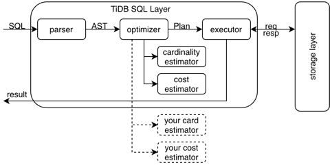

# LAB3 Integrate Your Estimator into TiDB

## Introduction

在 Lab3 中，将会把你在 Lab1 和 Lab2 中完成的模型，包装成 HTTP 服务，让 TiDB 进行调用，用于处理 SQL 请求。

下图是 TiDB SQL 层部分模块的结构图，在处理 SQL 过程中，优化器会多次调用基数估算和代价估算，你需要修改部分 TiDB 及你在 Lab1 和 Lab2 中的代码，以完成图中虚线部分内容：



## Preparation

TiDB 由 Golang 开发，因此需要提前准备好 Golang 的开发环境；Golang 环境的安装可见 [tidb-dev-guide/install-golang](https://pingcap.github.io/tidb-dev-guide/get-started/install-golang.html)。

本次 TiDB 中的 Golang 开发相对简单，不需要提前对 Golang 进行单独深入的学习，如果感兴趣或者在完成 Lab3 时有 Golang 相关的问题，可参考 [go-by-example](https://gobyexample-cn.github.io/)。

安装好 Golang 后，TiDB 的编译、运行可参考 [tidb-dev-guide/build-tidb-from-source](https://pingcap.github.io/tidb-dev-guide/get-started/build-tidb-from-source.html)。

如果有需要，可以安装 GoLand 作为你的 IDE，可参考 [tidb-dev-guide/setup-an-ide](https://pingcap.github.io/tidb-dev-guide/get-started/setup-an-ide.html)。

## Lab3

### TiDB

请使用 [summer-school](https://github.com/qw4990/tidb/tree/summer-school) 分支来完成 Lab3，该分支引入了变量 `tidb_external_cost_estimator_address` 和 `tidb_external_cardinality_estimator_address` 作为接口来设置服务调用的地址，如：

```sql
mysql> set tidb_external_cardinality_estimator_address='http://127.0.0.1:8888/cardinality';
Query OK, 0 rows affected (0.00 sec)

mysql> set tidb_external_cost_estimator_address='http://127.0.0.1:8888/cost';
Query OK, 0 rows affected (0.00 sec)

mysql> select @@tidb_external_cardinality_estimator_address, @@tidb_external_cost_estimator_address;
+-----------------------------------------------+----------------------------------------+
| @@tidb_external_cardinality_estimator_address | @@tidb_external_cost_estimator_address |
+-----------------------------------------------+----------------------------------------+
| http://127.0.0.1:8888/cardinality             | http://127.0.0.1:8888/cost             |
+-----------------------------------------------+----------------------------------------+
```

设置上述变量后，TiDB 便会尝试访问外部服务来获取基数估算和代价估算的结果，具体可见 [plan_cost.go](https://github.com/qw4990/tidb/blob/summer-school/planner/core/plan_cost.go) 中的 `callExternalCostEstimator` 和 [selectivity.go](https://github.com/qw4990/tidb/blob/summer-school/statistics/selectivity.go) 中的 `callExternalCardinalityEstimator` 函数。

对于 Lab1 和 Lab2 模型不支持的谓词条件或计划，TiDB 会自动判断并回退为使用内部的估算逻辑，具体可见 [selectivity.go](https://github.com/qw4990/tidb/blob/summer-school/statistics/selectivity.go) 中的 `fallbackToInternalCardinalityEstimator` 和 [plan_cost.go](https://github.com/qw4990/tidb/blob/summer-school/planner/core/plan_cost.go) 中的 `fallbackToInternalCostEstimator` 函数。

在 TiDB 部分，你需要完成下列函数中的 `YOUR CODE HERE` 部分：

1. [selectivity.go](https://github.com/qw4990/tidb/blob/summer-school/statistics/selectivity.go) 的 `wrapCNFExprsAsRequest`: 用于将 CNF 表达式包装成请求，并用于调用外部服务；
2. [selectivity.go](https://github.com/qw4990/tidb/blob/summer-school/statistics/selectivity.go) 的 `parseResponseAsSelectivity`: 将外部服务返回的数据解析成选择率并给 TiDB 使用；
3. [plan_cost.go](https://github.com/qw4990/tidb/blob/summer-school/planner/core/plan_cost.go) 的 `parseResponseAsSelectivity`: 将外部服务返回的数据解析成代价并给 TiDB 使用；

如果在调用远程服务的过程中发生了任何错误，TiDB 会以 warning 的形式反馈出来，如：

```sql
mysql> explain format='verbose' select * from title where kind_id>1 and kind_id<10;
+-------------------------+----------+-----------+-----------+---------------+----------------------------------------------------------------------+
| id                      | estRows  | estCost   | task      | access object | operator info                                                        |
+-------------------------+----------+-----------+-----------+---------------+----------------------------------------------------------------------+
| TableReader_7           | 250.00   | 10521.15  | root      |               | data:Selection_6, row_size: 757                                      |
| └─Selection_6           | 250.00   | 133422.27 | cop[tikv] |               | gt(test.title.kind_id, 1), lt(test.title.kind_id, 10), row_size: 757 |
|   └─TableFullScan_5     | 10000.00 | 103422.27 | cop[tikv] | table:title   | keep order:false, stats:pseudo, row_size: 757                        |
+-------------------------+----------+-----------+-----------+---------------+----------------------------------------------------------------------+
3 rows in set, 1 warnings (0.00 sec)

mysql> show warnings;
+---------+------+----------------------------------------------------------------------------------------------------------------------------------------------------------------------+
| Level   | Code | Message                                                                                                                                                              |
+---------+------+----------------------------------------------------------------------------------------------------------------------------------------------------------------------+
| Warning | 1105 | cannot get cost from the external cost estimator http://127.0.0.1:8888/cost: Post "http://127.0.0.1:8888/cost": dial tcp 127.0.0.1:8888: connect: connection refused |
+---------+------+----------------------------------------------------------------------------------------------------------------------------------------------------------------------+
```

### Your Estimator

模型部分你需要填写 `server.py` 中 `YOUR CODE HERE` 的部分，将你在 Lab1 和 Lab2 中训练出的模型包装成一个 HTTP 服务。

具体而言，你需要解析 TiDB 发送过来的请求，并调用你在 Lab1 和 Lab2 训练出来的模型，获取估算结果，并把结果返回给 TiDB。

在 Lab3 的测试中，数据来源与 Lab1 和 Lab2 一致(`imdb.title`)，因此理论上你不需要在 Lab3 再次重新训练，仅需要将模型导入并包装成服务即可。

在完成代码后，连接到你的 TiDB，创建 `imdb.title` 表：

```sql
CREATE DATABASE `imdb`;
USE `imdb`;
CREATE TABLE `title` (
    `id` int(11) NOT NULL,  
    `title` varchar(512) NOT NULL,
    `imdb_index` varchar(5) DEFAULT NULL,
    `kind_id` int(11) NOT NULL,
    `production_year` int(11) DEFAULT NULL,
    `imdb_id` int(11) DEFAULT NULL,
    `phonetic_code` varchar(5) DEFAULT NULL,
    `episode_of_id` int(11) DEFAULT NULL,
    `season_nr` int(11) DEFAULT NULL,
    `episode_nr` int(11) DEFAULT NULL,
    `series_years` varchar(49) DEFAULT NULL,
    `md5sum` varchar(32) DEFAULT NULL,
    PRIMARY KEY (`id`),
    KEY `kind_id_title` (`kind_id`),
    KEY `idx_year` (`production_year`),
    KEY `idx1` (`production_year`,`kind_id`,`season_nr`),
    KEY `idx2` (`kind_id`,`production_year`,`episode_nr`)
);
load data local infile ‘LAB1PATH/data/title_sample_1000.csv’ into table title fields terminated by ‘,’; -- optional
```

接着启动你的服务和你修改后的 TiDB，然后执行 `python evaluation.py`，会尝试用你的模式生成一些计划到 `eval/results.json` 里，接着上传 `results.json` 触发 autograding。


## Preparation for Lab4

Lab4 中需要使用到一个较大的词向量文件，请点击[这里](https://pan.baidu.com/s/14ZN1DqRcTOJJqsi8203suw)(密码: tt2s)提前下载，在 lab4 中会使用到其中的 wordvectors_updated.kv。