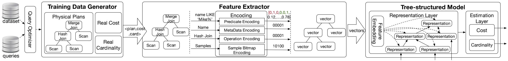
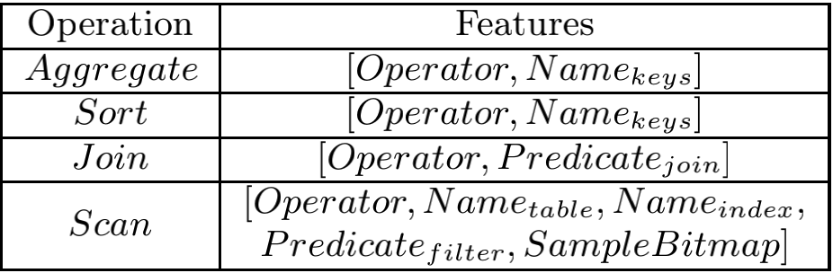
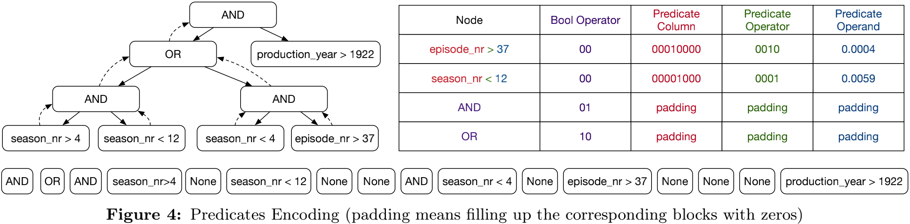
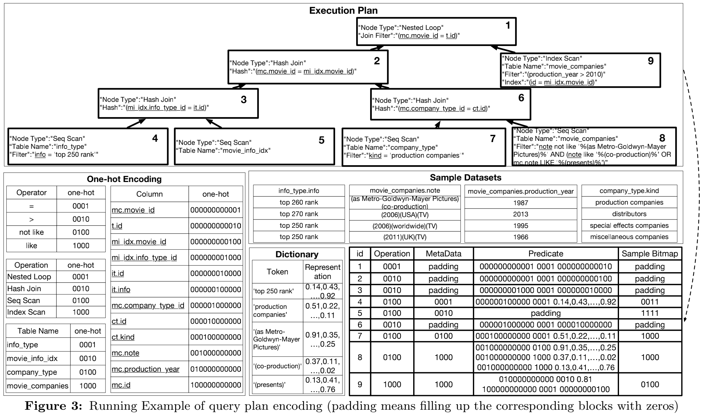
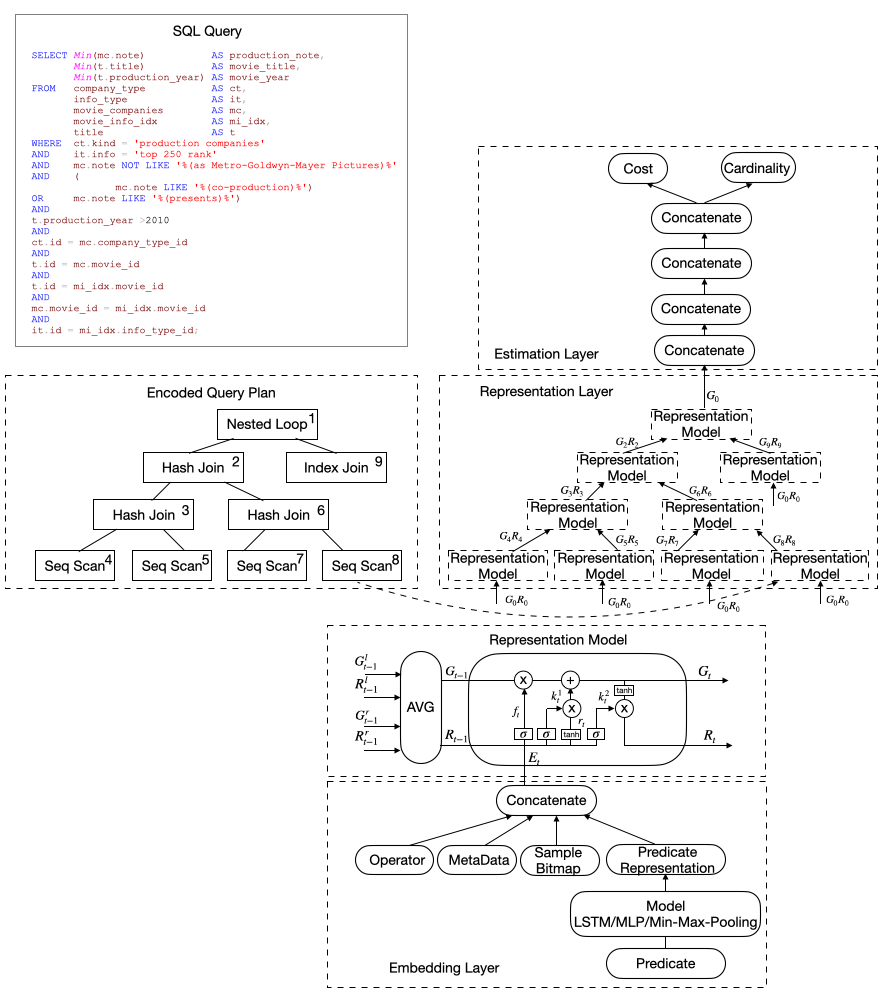
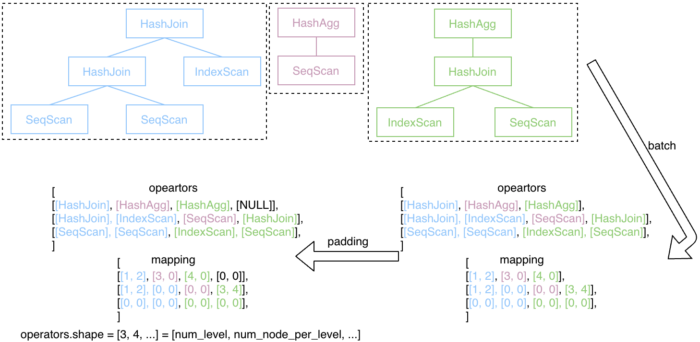
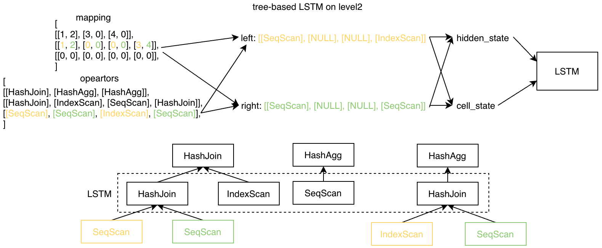

# LAB4 An End-to-End Learning-based Estimator

## Introduction

在 Lab4 中，你将会完成一个端到端的学习模型，他能接受查询计划作为输入，然后对这个计划进行基数估算和代价估算。

对比起 Lab2，他不需要依赖额外单独的基数估算模块，便能对计划的代价进行估算。

在离线训练中，整个过程如下：

1. 首先依赖传统的优化器生成 Plan，并得到实际的 Cost 和 Cardinality；
2. 在 Plan 上提取特征，并进行编码，最终每个 Plan 会形成一棵树，树的节点就是向量，包含了这个节点的特征；
3. 将编码后的数据丢给树状的模型进行训练；

在 Lab4 中，Plan 已经准备好了，你需要完成后续的特征提取及模型训练两个部分。

### Feature Extraction and Encoding

Plan 会被提取特征，并编码成一棵树，来每个节点的特征包含 4 个部分：

1. Operator: 这个节点对应的算子，如 HashJoin、IndexScan 等，每个算子会被编码成 one-hot 的形式；
2. Predicate: 这个节点包含的谓词条件，比如 Join 条件，或者 Scan 的过滤条件等，具体的编码方式见下面；
3. MetaData: 这个节点涉及的 table、column、index 等信息，如 Scan 使用的 table 和 index，Sort 和 Agg 使用的 column；
4. Sample-Bitmap: Scan 节点上用来表示对应的数据能否被当前的 Scan Fitler 选中；如 `bitmap[i]==True` 则说明第 i 行能满足这个过滤条件；由于整表的数据会比较大，这里我们在采样数据上维护这个 bitmap；

对于非复合的谓词条件，如 `movie.movie_id = mi_idx.movie_id`、`production_year > 1988` 等，会按照 `[Operator, Column, Operand]` 的形式进行编码；

对于复合的谓词条件，即多个非复合谓词通过 AND 和 OR 组合构成的谓词条件，会先对其中的非复合谓词进行编码，然后递归的把整个谓词条件映射成一个一维向量，下面是一个例子：

下面是一个完整的对 Plan 进行特征提取和编码的例子：

每个节点最终的编码情况在右下角对应的表格中，有几点需要注意：

1. 只有 Scan 类算子才会维护 bitmap；
2. 所有算子在编码后，会被 padding 成等长；
3. 对字符串的编码，我们直接使用现成的字典，具体见后面说明；其原理不在这里展开了，具体可见[原文](http://www.vldb.org/pvldb/vol13/p307-sun.pdf)；

### Model Design

整个模型的结构图如下：

端到端的模型主要分为三个模块：
1. embedding layer：用于把每个算子的 4 个特征做统一的处理并转化成一个张量；
2. representation layer：一个树状的 LSTM 模型，树的形状和 plan 一致，自底向上计算出各个节点的表示，包括 global vector 和 local vector，其中 global vector 捕捉以该节点为根的 subplan 的信息，local vector 捕捉该节点的信息；
3. estimation layer：根据 representation layer 的结果，预测出该 plan 的代价和基数；

### LAB4

在 LAB4 的具体实现中，Plan 的不同特征会被分开编码，最终会形成下面 7 个张量：

1. opeators: 这个 Plan 包含的算子信息；
2. extra_infos: 即 meta_data，每个算子所访问的列、索引等信息；
3. condition1s: 非索引的过滤条件，如 scan filter、join condition 等；
4. condition2s: 索引上的过滤条件；
5. samples: 采样的 bitmap 信息；
6. condition_masks: 表示对应的算子是否包含 sample bitmap；
7. mapping: 编码后每个算子儿子的在下一层的编号；

编码后的数据会按照深度进行组织，下面是 operators 和 mapping 的例子：

在编码后的 operators 中，会按照 level 进行组织，mapping 能够确定当前节点在下一个 level 中孩子节点的位置；

编码时会对多个 plan 的结果按照 level 进行 batch 和 padding，如下：

在进行 tree-based LSTM 迭代时，可以利用 mapping 来得到当前节点的左右儿子的数据，下面是一个例子：

通过 mapping 分别获取 level2 节点的左右孩子(level3)的 hidden_state 和 cell_state，计算后作为 level2 的 state，并传递给 LSTM 进行训练；

在 LAB4 中，你需要先通读代码，然后完成下面文件中的 `YOUR CODE HERE` 部分：

1. feature_extraction/node_feature.py: 对 Plan 中的一个节点进行特征提取；
2. feature_extraction/sample_bitmap.py: 生成 sample bitmap；
3. plan_encoding/encode_codition.py: 对谓词条件进行编码；
4. plan_encoding/encode_plan.py: 对 Plan 的特征进行编码；
5. training/representation_model.py: 训练用的模型;
6. main.py: 设置 word_vec 文件路径，word_vec 请点击[这里](https://pan.baidu.com/s/14ZN1DqRcTOJJqsi8203suw)(密码: tt2s)下载，解压后直接使用其中的 wordvectors_updated.kv；

完成之后，直接执行 main.py 对数据进行训练，训练完毕后会在 doc 目录下生成评估结果。